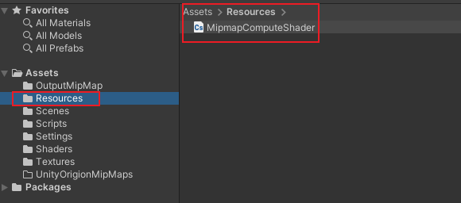
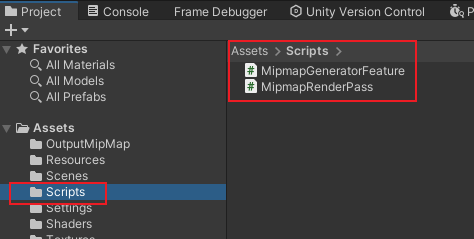
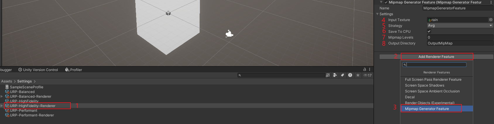
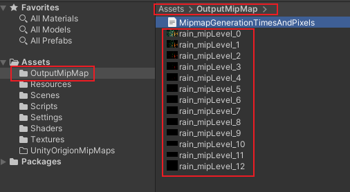
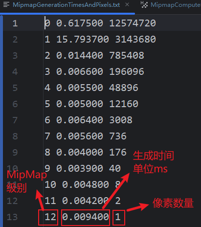

# 生成MipMap

核心目标：用户指定一张纹理，可生成任意 Mipmap 级别（用户可在Inspector中设置），默认构建全级别（即最粗糙的1x1），纹理的大小不限，可以 MxN 。生铖的图片可以保存到 CPU 用户指定的文件夹中。

技术方案：使用 RenderFeature + ComputeShader。

环境： Unity2022.3.48f1c1，URP

## 使用流程

算法主要包括三个文件： `MipMapComputeShader.compute` ，`MipmapGeneratorFeature.cs`， `MipmapRenderPass.cs`。

1. 必须将 `MipMapComputeShader.compute` 文件放在 Assets/Resources 文件夹下。`MipmapGeneratorFeature.cs` 和  `MipmapRenderPass.cs` 可放在其他文件夹下，下面示例中放在的是 Assets/Scripts 下。

2. 点击 Assets/Settings 启用的 Renderer ，将 MipMapGeneratorFeature 挂载上去。

参数解释：

​	a. Input Texture : 输入的纹理。

​	b. Strategy : 采样策略，分为 Max，Min，Avg。

​	c. Save To CPU ： 生成 MipMap 图片是否存储到CPU文件夹下。

​	d. Mipmap Levels : 生成 MipMap 的级别数，0 为默认生成到 1*1 像素级别。

​	e. Output Directory : 输出图片的文件夹名称，会在 Assets 下添加该文件夹。

## 图片输出结果

默认在 Assets/OutputMipMap 下生保存图片结果，用户可按照上述指定文件夹输出。除了MipMap图片之外，还有一个名为 `MipmapGenerationTimesAndPixels.txt` 文件，该文件保存了生成的 MipMap 图片等级、生成时间和像素数量。

## 和python库对比结果

python的代码见文末。

### 对比方法

使用python库的三种对比方式，分别为逐像素对比、颜色直方图、SSIM 以及 MSE 方法，分别在 Max、Min、Avg条件下进行对比。

### python使用方法

## 遇到问题

1. 使用ComputeShader采样出来的纹理，会导致颜色变暗。初步断定为 RenderTexture 和 Texture 转换的格式有误。RenderTexture 使用的是 HDR 存储格式，而 Texture2D 使用普通存储。
2. Compute Shader 的算法问题。不理解为何将整个画面一份为四，是错误的颜色，理论上不应该超出判断条件。
3. 普通采样颜色颜色显示比原来黑。需要在ComputeShader中添加 gamma 矫正才能进行转换。

### 参阅过的解决方案

1. [MiniCompute](https://github.com/cinight/MinimalCompute)
2. [从计算着色器 Unity 中的 RWTexture2D 读取数据](https://stackoverflow.com/questions/72375421/reading-data-from-rwtexture2d-in-compute-shader-unity)
3. 

## 附录

### Mipmap产生原理

滤波+采样

滤波：均值滤波，高斯滤波

采样：二分下采样、计算统计值

GPU在处理FragmentShader的时候，并不是每个片元单独处理，而是打成一个 2*2 的区块进行处理。

### python对比方法代码
